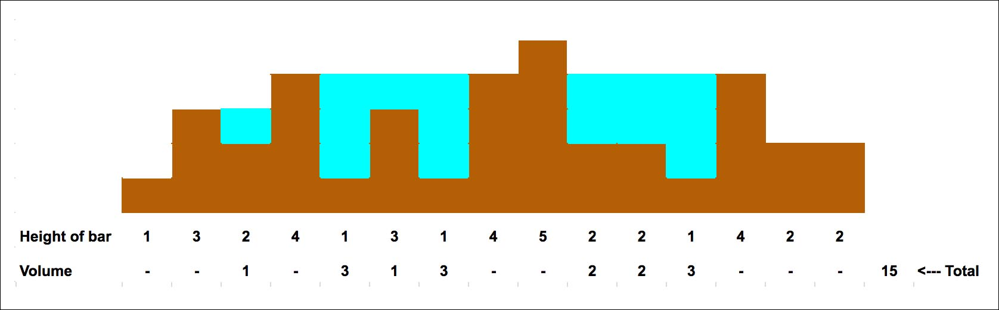

# The Challenge

Imagine an island that is in the shape of a bar graph. When it rains, certain areas of the island fill up with rainwater to form lakes. Any excess rainwater the island cannot hold in lakes will run off the island to the west or east and drain into the ocean.

Given an array of positive integers representing 2-D bar heights, design an algorithm (or write a function) that can compute the total volume (capacity) of water that could be held in all lakes on such an island given an array of the heights of the bars. Assume an elevation map where the width of each bar is 1.



```
Example: Given [1,3,2,4,1,3,1,4,5,2,2,1,4,2,2], return 15 (3 bodies of water with volumes of 1,7,7 yields total volume of 15)
```

---

## Learning objectives

This question offers practice with algorithms, data structures, Big-O, defining functions, generalization, efficiency, time and space complexity, and anticipating edge cases.

---

## Solution

The solution steps are:

1. Find the index of maximum height from heights array/list

2. Traverse from start and end of heights list/array till the index of maximum height.

3. Calculate volume while traversing accordingly.

---

### For more help, You can check the code OR

[Visit Google Tech Guide page](https://techdevguide.withgoogle.com/resources/former-interview-question-volume-of-lakes/#!)
