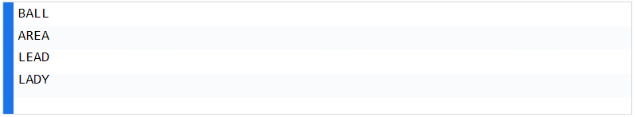

# The Challenge

A "word square' is an ordered sequence of K different words of length K that, when written one word per line, reads the same horizontally and vertically. For example:



```
In this exercise you're going to create a way to find word squares.

First, design a way to return true if a given sequence of words is a word square.

Second, given an arbitrary list of words, return all the possible word squares it contains. Reordering is allowed.

For example, the input list

[AREA, BALL, DEAR, LADY, LEAD, YARD]

should output

[(BALL, AREA, LEAD, LADY), (LADY, AREA, DEAR, YARD)]

Finishing the first task should help you accomplish the second task.
```

---

## Learning objectives

This problem gives practice with algorithms, recursion, arrays, progressively optimizing from an initial solution, and testing.

---

### For more help, You can check the code OR

[Visit Google Tech Guide page](https://techdevguide.withgoogle.com/resources/former-interview-question-word-squares/#!)
